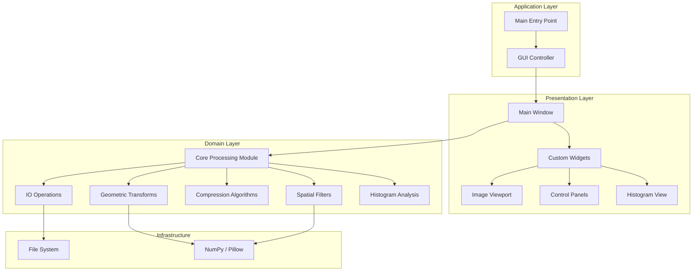
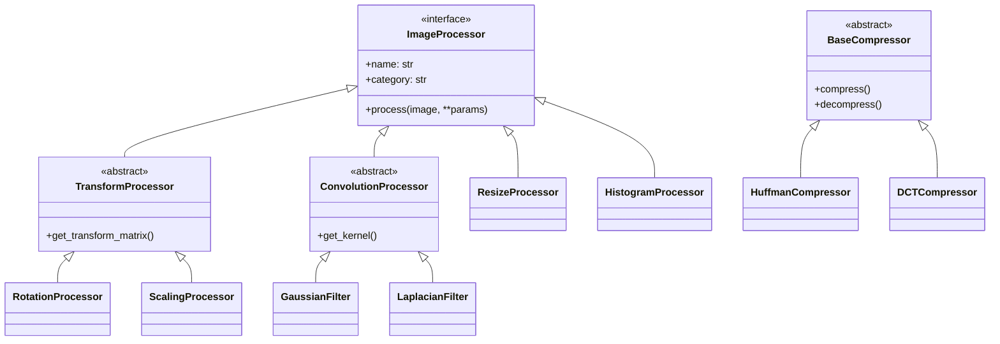

# Image Processing Mini-Suite

A robust, modular image processing application built with Python and PySide6, designed for educational and practical image manipulation tasks. This suite provides a comprehensive set of tools for geometric transformations, spatial filtering, and compression analysis within a modern graphical user interface.

## Architecture

The application follows a layered architecture, separating the graphical user interface from the core processing logic to ensure maintainability and scalability.



## Features

### Core Capabilities
- **Geometric Transformations**: Precision control over translation, scaling, rotation, and shearing using homogeneous coordinates.
- **Spatial Filtering**: Implementation of standard kernels including Gaussian, Median, Laplacian, and Sobel for edge detection and noise reduction.
- **Interpolation Engines**: Multiple algorithms (Nearest Neighbor, Bilinear, Bicubic) for high-quality image resizing.
- **Compression Analysis**: Educational implementations of 10+ compression techniques including Huffman, LZW, DCT, and Wavelet.

### User Interface
- **Real-time Preview**: Immediate visual feedback for all processing operations.
- **Histogram Analysis**: Live histogram visualization for intensity distribution analysis.
- **Region of Interest**: Interactive cropping and region selection tools.

## Technical Manual

This section provides a deep dive into the system's core components, algorithms, and API.

### Core Architecture

The system is built on a plugin-like architecture where all operations inherit from abstract base classes.

- **`ProcessorRegistry`**: Central singleton that manages available processors. Enables the Open/Closed principle—new processors are registered here without modifying the GUI.
- **`ParamInfo`**: Metadata system that allows processors to define their own UI parameters (type, range, default), enabling the GUI to auto-generate dialogs.



### API Reference

#### Geometric Transforms (`app.core.transforms`)
All transforms use 3x3 homogeneous matrices.

- **`TranslationProcessor`**: Shifts image by $(t_x, t_y)$.
- **`ScalingProcessor`**: Scales by $(s_x, s_y)$ around a center point.
- **`RotationProcessor`**: Rotates by $\theta$ degrees. Can optionally expand canvas to fit.
- **`ShearXProcessor` / `ShearYProcessor`**: Applies horizontal or vertical shear.

#### Spatial Filters (`app.core.filters`)
Convolution-based filters using `scipy.signal.convolve2d` (or manual equivalent).

- **`GaussianFilter`**: Low-pass filter for noise reduction. Default kernel size $19 \times 19$, $\sigma=3.0$.
- **`MedianFilter`**: Non-linear filter for salt-and-pepper noise. Default size $7 \times 7$.
- **`LaplacianFilter`**: Second-derivative edge detection.
- **`SobelFilter`**: First-derivative edge detection. Supports X, Y, or Magnitude direction.
- **`SharpeningFilter`**: Unsharp masking (Original + Amount * (Original - Blurred)).

#### Interpolation (`app.core.interpolation`)
Manual implementation of resampling algorithms.

- **`NearestNeighborResizer`**: Fastest, $O(1)$ lookup.
- **`BilinearResizer`**: Weighted average of 4 neighbors.
- **`BicubicResizer`**: Weighted average of 16 neighbors using Catmull-Rom splines.

#### Compression (`app.core.compression`)
Educational implementations for analysis (calculates ratio, space savings).

1.  **Huffman**: Frequency-based prefix coding.
2.  **Golomb-Rice**: Optimal for geometric distributions (used for prediction residuals).
3.  **Arithmetic**: Encodes entire message as a single floating-point interval.
4.  **LZW**: Dictionary-based compression (GIF/TIFF style).
5.  **RLE**: Run-Length Encoding for repetitive data.
6.  **Symbol-Based**: Block dictionary coding.
7.  **Bit-Plane**: Decomposes image into 8 binary planes, compressed separately.
8.  **DCT**: Discrete Cosine Transform (JPEG basis). Quantizes frequency coefficients.
9.  **Predictive**: Encodes difference between pixel and neighbor (Left/Top/Avg).
10. **Wavelet**: Haar wavelet transform with thresholding.

#### Histogram (`app.core.histogram`)
- **`HistogramProcessor`**: Computes statistics (Mean, StdDev, Dynamic Range) and analyzes contrast quality.
- **`HistogramEqualizationProcessor`**: Flattens the histogram using CDF mapping to maximize contrast.

#### Format Conversions (`app.core.conversions`)
- **`GrayscaleProcessor`**: Converts RGB to luminance using ITU-R BT.601 weights ($0.299R + 0.587G + 0.114B$).
- **`BinaryThresholdProcessor`**: 
    - Supports manual threshold (0-255).
    - **Auto-Threshold**: Uses mean intensity if not specified.
    - **Evaluation**: `evaluate_threshold()` calculates inter-class variance (Otsu-like metric) to judge separation quality.

#### Low-Level Primitives (`app.core.primitives`)
Pure functional implementations of core operations.

- **`convolve2d`**: Manual 2D convolution engine. Supports arbitrary kernel sizes.
- **Boundary Handling**:
    - `CONSTANT`: Pad with zero.
    - `REPLICATE`: Repeat edge pixels (default).
    - `REFLECT`: Mirror image at borders.
    - `WRAP`: Periodic tiling.
- **Kernel Builders**: Factory functions for Gaussian, Box, Laplacian, Sobel, and Prewitt kernels.

#### IO & Metadata (`app.core.io`)
- **`load_image` / `save_image`**: Robust wrappers around Pillow.
- **`get_image_metadata`**: Extracts dimensions, channels, and file size without loading pixel data.

### Algorithm Specifications

#### Affine Matrix Definitions
Transforms map source $(x, y)$ to destination $(x', y')$ via matrix $M$:
$$
\begin{bmatrix} x' \\ y' \\ 1 \end{bmatrix} = M \begin{bmatrix} x \\ y \\ 1 \end{bmatrix}
$$

- **Translation**:
  $$ \begin{bmatrix} 1 & 0 & t_x \\ 0 & 1 & t_y \\ 0 & 0 & 1 \end{bmatrix} $$
- **Scaling**:
  $$ \begin{bmatrix} s_x & 0 & 0 \\ 0 & s_y & 0 \\ 0 & 0 & 1 \end{bmatrix} $$
- **Rotation**:
  $$ \begin{bmatrix} \cos\theta & -\sin\theta & 0 \\ \sin\theta & \cos\theta & 0 \\ 0 & 0 & 1 \end{bmatrix} $$
- **Shear X**:
  $$ \begin{bmatrix} 1 & sh_x & 0 \\ 0 & 1 & 0 \\ 0 & 0 & 1 \end{bmatrix} $$

#### Bicubic Interpolation Weight
Uses the Catmull-Rom spline kernel $W(x)$ where $a = -0.5$:
$$
W(x) = \begin{cases} 
(a+2)|x|^3 - (a+3)|x|^2 + 1 & \text{if } |x| \le 1 \\
a|x|^3 - 5a|x|^2 + 8a|x| - 4a & \text{if } 1 < |x| \le 2 \\
0 & \text{otherwise}
\end{cases}
$$

#### DCT Compression Steps
1.  Divide image into $8 \times 8$ blocks.
2.  Shift values by -128.
3.  Apply Forward DCT: $F(u,v) = \frac{1}{4} C(u)C(v) \sum_{x=0}^7 \sum_{y=0}^7 f(x,y) \cos[\frac{(2x+1)u\pi}{16}] \cos[\frac{(2y+1)v\pi}{16}]$
4.  Quantize: $F_Q(u,v) = \text{round}(F(u,v) / Q(u,v))$ using standard JPEG luminance matrix.

### Extensibility Guide

To add a new processor:

1.  **Inherit**: Create a class inheriting from `ImageProcessor` (or a specific subclass like `ConvolutionProcessor`).
2.  **Implement**: Define `name`, `category`, `get_default_params`, `get_param_info`, and `process`.
3.  **Register**: Add the instance to `MainWindow.__init__` and handle it in `_on_operation_requested`.

Example:
```python
class MyFilter(ConvolutionProcessor):
    @property
    def name(self): return "My Custom Filter"
    
    def get_kernel(self, **params):
        return np.ones((3,3)) / 9.0  # Box blur
```

## Installation & Deployment

### Prerequisites
- Python 3.8 or higher
- pip package manager

### Setup

1.  **Clone the repository**
    ```bash
    git clone <repository-url>
    cd IP-Project---image-processing-suite
    ```

2.  **Create a virtual environment**
    ```bash
    python -m venv venv
    source venv/bin/activate  # On Windows: .\venv\Scripts\activate
    ```

3.  **Install dependencies**
    ```bash
    pip install -r requirements.txt
    ```

## Usage Guide

### Launching the Application
Execute the main module from the project root:

```bash
python -m app.main
```

### Workflow
1.  **Load Image**: Use `File > Open` or drag-and-drop an image into the viewport.
2.  **Select Operation**: Choose a tool from the side panel.
3.  **Configure Parameters**: Adjust sliders/inputs.
4.  **Apply**: Click "Apply" to commit changes.
5.  **Save**: Use `File > Save As`.

## Project Structure

```text
IP-Project/
├── app/
│   ├── core/           # Domain Logic
│   │   ├── compression.py
│   │   ├── conversions.py
│   │   ├── filters.py
│   │   ├── histogram.py
│   │   ├── interfaces.py
│   │   ├── interpolation.py
│   │   ├── io.py
│   │   ├── primitives.py
│   │   └── transforms.py
│   ├── gui/            # Presentation Layer
│   │   ├── main_window.py
│   │   └── widgets/
│   └── main.py         # Entry Point
├── tests/              # Unit Tests
├── assets/             # Icons and Resources
├── requirements.txt
└── README.md
```

## Testing

The project uses `pytest` for unit testing.

1.  **Install test dependencies** (if not already installed):
    ```bash
    pip install pytest
    ```

2.  **Run all tests**:
    ```bash
    pytest tests/
    ```

3.  **Run specific test file**:
    ```bash
    pytest tests/test_primitives.py
    ```

## Development Principles

- **SOLID**: Single Responsibility, Open/Closed, Liskov Substitution, Interface Segregation, Dependency Inversion.
- **DRY**: Code reuse via base classes and utility modules.
- **Type Safety**: Full Python type hinting.

## Contributing

1.  Fork the repository
2.  Create a feature branch
3.  Commit your changes
4.  Push to the branch
5.  Create a Pull Request
