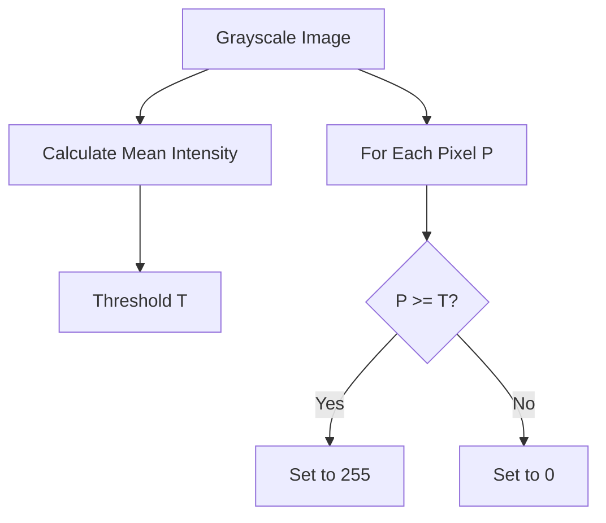

# Core Conversions (`app.core.conversions`)

## Overview
This module handles **Format Conversions**, specifically changing the color space or bit depth of an image. The primary operations are converting Color to Grayscale and Grayscale to Binary (Black & White).

## Ideology: Smart Defaults
While conversion seems simple, choosing the right parameters (like the threshold for B&W) is hard.
-   **Automatic Analysis**: We implement smart algorithms (Mean Intensity, Variance Analysis) to guess the best parameters for the user, while still allowing manual override.

## Visualizing Thresholding

## Simplification: The Bouncer
-   **Grayscale**: Taking a color photo and photocopying it. You lose the color info, but keep the structure.
-   **Thresholding**: The Bouncer at a club. He has a strict rule (the Threshold).
    -   "You're cool enough (bright enough)? Come in (White)."
    -   "Not cool enough (too dark)? Get out (Black)."
    -   The result is a stark, high-contrast image with no grays.

## Technical Details

### `GrayscaleProcessor`
-   **Method**: Weighted sum of RGB channels.
    $$ Y = 0.299R + 0.587G + 0.114B $$
-   **Why weights?** Humans see Green much brighter than Blue. A pure Blue image looks dark to us, so we give it a low weight (0.114).

### `BinaryThresholdProcessor`
-   **Manual Mode**: User picks a number 0-255.
-   **Auto Mode**: Uses the **Mean Intensity** of the image as the starting point.
-   **`evaluate_threshold`**: A helper function that checks if the chosen threshold is "good".
    -   It calculates **Inter-Class Variance** (similar to Otsu's method).
    -   If the variance is high, it means the threshold successfully separated the foreground from the background.
    -   If variance is low, it warns the user that the result might look messy.

## Code Reference

### `GrayscaleProcessor`
Converts RGB images to grayscale.
*   Uses standard luminance weights: $0.299R + 0.587G + 0.114B$.

### `BinaryThresholdProcessor`
Converts images to binary (black and white).
*   `threshold`: Cutoff value (0-255). If `None`, uses mean intensity.
*   `invert`: If `True`, flips black and white.

### `evaluate_threshold`
`def evaluate_threshold(image, threshold=None) -> dict`
Evaluates if a threshold is optimal using inter-class variance.
*   **Returns**: Dictionary with `is_optimal`, `foreground_ratio`, and `analysis`.
