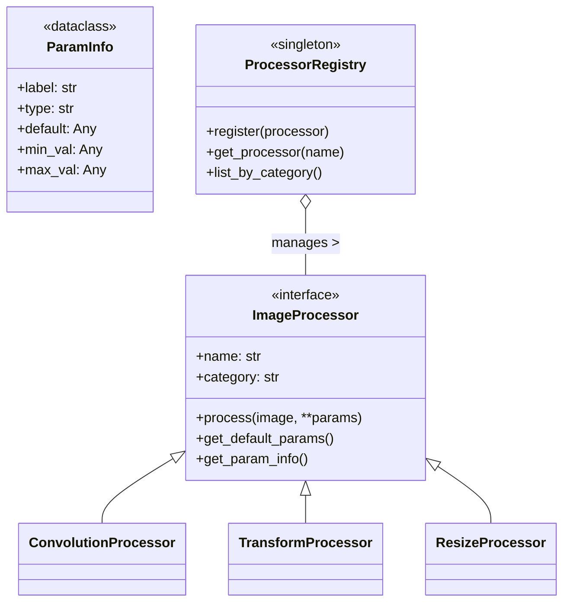

# Core Interfaces (`app.core.interfaces`)

## Overview
This module defines the **contract** that all image processing operations must follow. It establishes the plugin architecture that allows the application to be easily extended with new features without modifying existing code.

## Ideology: The "Plug-and-Play" Philosophy
The design follows the **SOLID** principles of object-oriented programming, specifically:
-   **Open/Closed Principle**: The system is open for extension (adding new processors) but closed for modification (no need to change the GUI code).
-   **Dependency Inversion**: High-level modules (GUI) depend on abstractions (`ImageProcessor`), not concrete details (`GaussianFilter`).

By defining strict interfaces, we ensure that every processor—whether it's a simple blur or a complex compression algorithm—looks and behaves the same way to the rest of the application.

## Architecture

## Simplification: The Universal Remote
Imagine a universal remote control (the GUI). It doesn't know how a specific TV, DVD player, or Sound System works inside. It just knows they all have an "On/Off" button and "Volume" controls.

-   **`ImageProcessor`**: This is the agreement that every device must have an "On" button.
-   **`ParamInfo`**: This tells the remote "I have a volume dial that goes from 0 to 100".
-   **`ProcessorRegistry`**: This is the manual that lists all the devices the remote can control.

## Technical Details

### `ImageProcessor` (Abstract Base Class)
The parent of all operations.
-   **`process(image, **params)`**: The main workhorse. It takes a numpy array and returns a *new* numpy array. It never modifies the original (Command-Query Separation).
-   **`get_param_info()`**: Returns a dictionary describing what knobs and dials the UI should show. This allows the UI to be auto-generated!

### `ParamInfo`
A data container that describes a single parameter.
-   **`param_type`**: Tells the UI whether to show a slider (`int`/`float`), a checkbox (`bool`), or a dropdown (`choice`).
-   **`min_val`/`max_val`**: Sets the limits for sliders.

### `ProcessorRegistry`
A central storage for all available tools.
-   **Why?** It decouples the "creation" of tools from their "usage". The main window just asks the registry "What tools do you have?" and builds the menu dynamically.

### Specialized Interfaces
-   **`ConvolutionProcessor`**: For filters that use a kernel (like Blur or Edge Detection). It forces you to define `get_kernel()`.
-   **`TransformProcessor`**: For geometric moves (Rotate, Scale). It forces you to define `get_transform_matrix()`.
-   **`ResizeProcessor`**: Specifically for changing image dimensions.

## Code Reference

### `ImageProcessor`
*Abstract Base Class*
The base class for all image processing operations.

*   `process(image: np.ndarray, **params) -> np.ndarray`:
    Abstract method. Processes the input image and returns the result.
    *   `image`: Input image (H, W) or (H, W, C).
    *   `params`: Keyword arguments for parameters.

*   `get_default_params() -> dict`:
    Returns a dictionary of default parameter values.

*   `get_param_info() -> dict[str, ParamInfo]`:
    Returns a dictionary mapping parameter names to `ParamInfo` objects.

### `ParamInfo`
*Dataclass*
Metadata for a single parameter.

*   `label`: Human-readable name.
*   `param_type`: 'int', 'float', 'bool', or 'choice'.
*   `default`: Default value.
*   `min_val`, `max_val`: Range constraints.
*   `choices`: Tuple of valid options (for 'choice' type).

### `ProcessorRegistry`
*Singleton*
Registry for managing available processors.

*   `register(processor: ImageProcessor)`:
    Registers a new processor instance.
*   `get_processor(name: str) -> ImageProcessor`:
    Retrieves a processor by name.
*   `list_by_category() -> dict[str, list[ImageProcessor]]`:
    Returns processors grouped by category.
