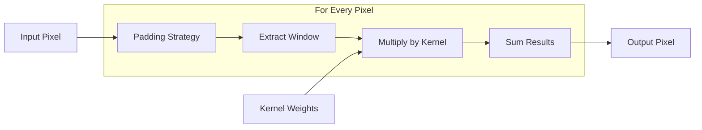

# Core Primitives (`app.core.primitives`)

## Overview
This module contains the **atoms** of the image processing suite. It implements the low-level mathematical operations that other processors build upon. It is a library of pure functions with no side effects.

## Ideology: Educational Transparency
In a production environment, we would use optimized libraries like `OpenCV` or `scipy.signal`. However, the goal of this project is **education**.
-   **Manual Implementation**: We implement convolution, padding, and kernel generation from scratch.
-   **Transparency**: You can read the code to see exactly how a Gaussian Blur is calculated mathematically, rather than calling a black-box function.

## Visualizing Convolution
Convolution is the heart of spatial filtering. It involves sliding a small window (kernel) over the image.

## Simplification: The Cookie Cutter
Think of the image as a sheet of dough.
-   **`convolve2d`**: This is the process of stamping cookies.
-   **`kernel`**: This is the shape of the cookie cutter. A "Blur" cutter makes edges soft. An "Edge" cutter cuts sharp lines.
-   **`pad_image`**: What happens at the edge of the dough? Do we pretend there's more dough (`REPLICATE`)? Or do we stop (`CONSTANT`)?

## Technical Details

### Boundary Handling (`BorderMode`)
When a kernel slides to the edge of an image, it hangs off. We must "invent" pixels to fill the gap.
-   **`CONSTANT`**: Fill with zeros (black). Good for simple cases but creates dark borders.
-   **`REPLICATE`**: Copy the edge pixel. Best for photos (aaabbb...).
-   **`REFLECT`**: Mirror the image (abc|cba). Smooth continuity.
-   **`WRAP`**: Tile the image (abc|abc). Good for textures.

### `convolve2d`
The manual 2D convolution engine.
1.  **Pads** the image based on kernel size.
2.  **Iterates** over every pixel (nested loops).
3.  **Extracts** the neighborhood.
4.  **Computes** the weighted sum: $\sum \sum I(x-i, y-j) \cdot K(i, j)$.

### Kernel Builders
Factory functions that generate standard matrices.
-   **`build_gaussian_kernel`**: Uses the Gaussian function $e^{-(x^2+y^2)/(2\sigma^2)}$. Creates a bell-curve shape.
-   **`build_sobel_kernels`**: Returns two kernels, one for horizontal changes ($G_x$) and one for vertical ($G_y$).

### Color Conversion
-   **`rgb_to_grayscale`**: Uses the human eye's sensitivity formula:
    $$ Y = 0.299R + 0.587G + 0.114B $$
    Green is weighted highest because our eyes are most sensitive to it.

## Code Reference

### `get_pixel_safe`
`def get_pixel_safe(image, y, x, border_mode=BorderMode.REPLICATE, constant_value=0.0) -> value`
Safely retrieves a pixel value, handling out-of-bounds access according to the border mode.

### `pad_image`
`def pad_image(image, pad_y, pad_x, border_mode=BorderMode.REPLICATE, constant_value=0.0) -> np.ndarray`
Returns a padded copy of the image.

### `convolve2d`
`def convolve2d(image, kernel, border_mode=BorderMode.REPLICATE) -> np.ndarray`
Performs 2D convolution on the image using the given kernel. Supports both grayscale and color images.

### `apply_median_filter`
`def apply_median_filter(image, kernel_size, border_mode=BorderMode.REPLICATE) -> np.ndarray`
Applies a median filter of the specified size.

### Kernel Builders
*   `build_gaussian_kernel(size, sigma) -> np.ndarray`: Creates a normalized 2D Gaussian kernel.
*   `build_box_kernel(size) -> np.ndarray`: Creates a normalized box (average) kernel.
*   `build_laplacian_kernel(variant="standard") -> np.ndarray`: Creates a Laplacian kernel (standard or diagonal).
*   `build_sobel_kernels() -> (np.ndarray, np.ndarray)`: Returns X and Y Sobel kernels.

### Color Conversion
*   `rgb_to_grayscale(image) -> np.ndarray`: Converts RGB to grayscale using luminance weights.
*   `grayscale_to_rgb(image) -> np.ndarray`: Converts grayscale to RGB by replicating channels.
