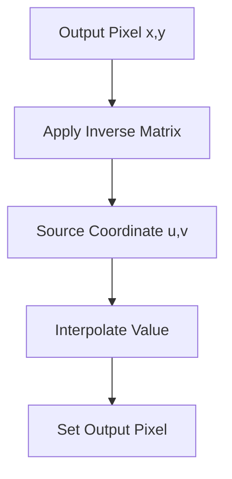

# Core Transforms (`app.core.transforms`)

## Overview
This module implements **Geometric Transformations**: moving, resizing, rotating, and shearing images. It uses linear algebra (matrix multiplication) to map pixels from one place to another.

## Ideology: The Power of Matrices
Instead of writing separate, complex loops for every type of movement, we use **Affine Matrices**.
-   **Unified Logic**: Translation, Rotation, and Scaling are all just different 3x3 matrices. The underlying code (`apply_transform`) is exactly the same for all of them!
-   **Homogeneous Coordinates**: We use 3x3 matrices for 2D images. The extra dimension allows us to represent "Translation" (moving) as a multiplication, which isn't possible with 2x2 matrices.

## Visualizing the Transform
We use **Inverse Mapping** to avoid holes in the output image. Instead of asking "Where does this input pixel go?", we ask "For this output pixel, where did it come from?".

## Simplification: Stretching the Canvas
Imagine the image is drawn on a rubber sheet.
-   **`Translation`**: Sliding the sheet on the table.
-   **`Scaling`**: Stretching or shrinking the sheet.
-   **`Rotation`**: Pinning the center and spinning the sheet.
-   **`Shear`**: Holding the bottom edge and pushing the top edge sideways (slanting).

## Technical Details

### Affine Matrices
We map $(x, y)$ to $(x', y')$ using:
$$
\begin{bmatrix} x' \\ y' \\ 1 \end{bmatrix} = \begin{bmatrix} a & b & tx \\ c & d & ty \\ 0 & 0 & 1 \end{bmatrix} \begin{bmatrix} x \\ y \\ 1 \end{bmatrix}
$$

-   **Translation**: $tx, ty$ shift the image.
-   **Scale**: $a, d$ control size.
-   **Shear**: $b, c$ control slant.
-   **Rotation**: Uses $\sin$ and $\cos$ in $a, b, c, d$.

### `apply_transform`
The engine that applies the matrix.
1.  **Inverts** the matrix ($M^{-1}$).
2.  **Iterates** over every pixel in the *output* image.
3.  **Maps** output coordinate $(x, y)$ back to source $(u, v)$ using $M^{-1}$.
4.  **Samples** the source image at $(u, v)$ using the selected interpolation method (Nearest, Bilinear, or Bicubic).

### Processors
-   **`TranslationProcessor`**: Shifts image.
-   **`ScalingProcessor`**: Resizes. Can scale from center or top-left.
-   **`RotationProcessor`**: Rotates around center. Can `expand` the canvas to fit the corners (so they don't get cut off).
-   **`ShearXProcessor` / `ShearYProcessor`**: Slants the image horizontally or vertically.

## Code Reference

### `apply_transform`
`def apply_transform(image, matrix, output_shape=None, interpolation=InterpolationMethod.BILINEAR) -> np.ndarray`
Applies an affine transformation matrix to the image.
*   `matrix`: 3x3 affine matrix (inverse mapping).
*   `interpolation`: Sampling method (`NEAREST`, `BILINEAR`, `BICUBIC`).

### Sampling Functions
*   `_nearest_neighbor_sample(image, y, x) -> value`: Returns the nearest pixel value.
*   `_bilinear_sample(image, y, x) -> value`: Interpolates using 4 neighbors.
*   `_bicubic_sample(image, y, x) -> value`: Interpolates using 16 neighbors with Catmull-Rom splines.

### Processors
*   `TranslationProcessor`: Shifts image by `(tx, ty)`.
*   `ScalingProcessor`: Scales image by `scale` factor.
*   `RotationProcessor`: Rotates image by `angle` degrees.
*   `ShearXProcessor`: Shears along X-axis by `factor`.
*   `ShearYProcessor`: Shears along Y-axis by `factor`.
